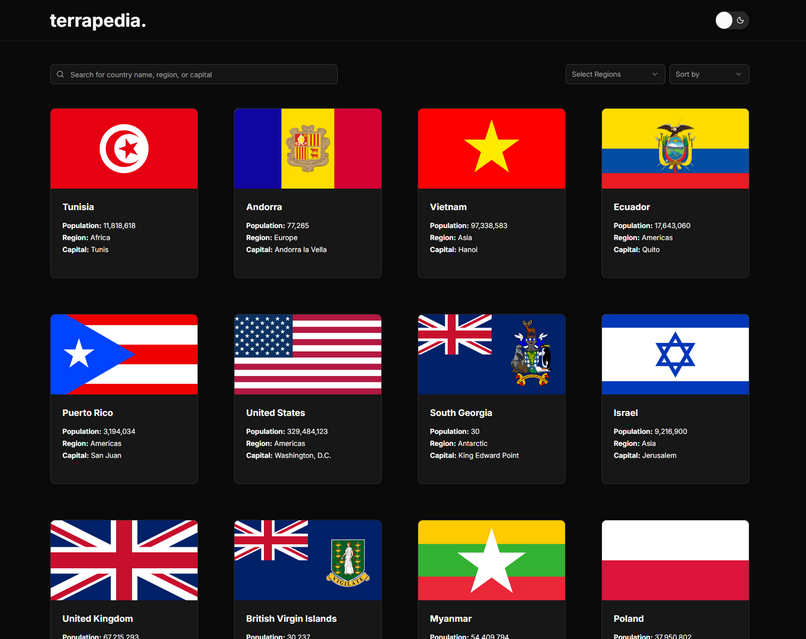
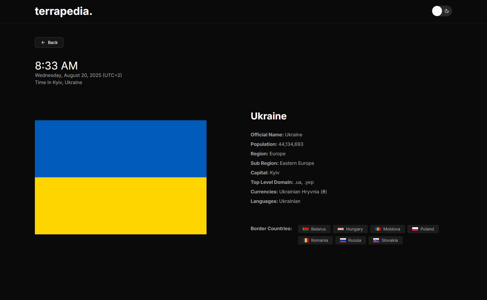

# Terrapedia - Your Guide to the World's Countries

Terrapedia is a modern country information web app that lets you explore details about countries from around the world. Powered by the [REST Countries API](https://restcountries.com/), it provides an intuitive and responsive interface with search, sorting, filtering, and pagination features.

## 🌐 Live Demo

Explore Terrapedia live 👉 [terrapedia.vercel.app](https://terrapedia.vercel.app)

## 📚 Challenge

This project was built for the Frontend Mentor - REST Countries API with color theme switcher challenge.
Frontend Mentor challenges help you improve your coding skills by building realistic projects.

👉 [View the challenge here](https://www.frontendmentor.io/challenges/rest-countries-api-with-color-theme-switcher-5cacc469fec04111f7b848ca)

## ✨ Features

| Function          | Description                                                  |
| :---------------- | :----------------------------------------------------------- |
| Dark Mode         | Seamless light/dark theme toggle.                            |
| Search            | Find countries by **name**, **capital**, or **region**.      |
| Sort              | Sort countries by **population** or **alphabetical order**.  |
| Region Filter     | Quickly filter countries by continent/region.                |
| Pagination        | Smooth navigation for large country lists.                   |
| Time Zone         | Displays the current **date** and **time** for each country. |
| Responsive Design | Optimized for desktop, tablet, and mobile.                   |
| Animations        | Beautiful transitions powered by Framer Motion.              |

## 🛠 Tech Stack

| Tech Stack                                      | Description                               |
| :---------------------------------------------- | :---------------------------------------- |
| [Next.js v15](https://nextjs.org/)              | React framework with SSR support          |
| [TypeScript](https://www.typescriptlang.org/)   | Strongly typed JavaScript                 |
| [Tailwind CSS v4](https://tailwindcss.com/)     | Utility-first styling                     |
| [shadcn/ui](https://ui.shadcn.com/)             | Accessible and customizable UI components |
| [Framer Motion](https://www.framer.com/motion/) | Smooth animations and transitions         |
| [Luxon](https://moment.github.io/luxon/)        | Modern date/time handling                 |

## 🚀 Getting Started

**Fork this repo**
You can fork this repo by clicking the fork button in the top right corner of this page.

**Clone on your local machine**

```bash
git clone https://github.com/engrjvramos/terrapedia.git
```

**Navigate to project directory**

```bash
cd terrapedia
```

**Create a new branch**

```bash
git checkout -b my-new-branch
```

**Install dependencies**

```bash
pnpm install
```

**Run the development server**

```bash
pnpm run dev
```

Visit [http://localhost:3000](http://localhost:3000) to see the app in action.

## 📦 API Reference

This project uses the [REST Countries API](https://restcountries.com/) to fetch real-time country data.

**To get all countries:**

```http
GET https://restcountries.com/v3.1/all?fields={fields}
```

**To get country by code (cca3):**

```http
GET https://restcountries.com/v3.1/alpha/{code}
```

## 📷 Screenshots




## 🤝 Contributing

Contributions are welcome! If you’d like to improve **Terrapedia**, please fork the repo and submit a PR.

## 📄 License

This project is open-source under the MIT License. Feel free to fork, modify, and build upon it.
